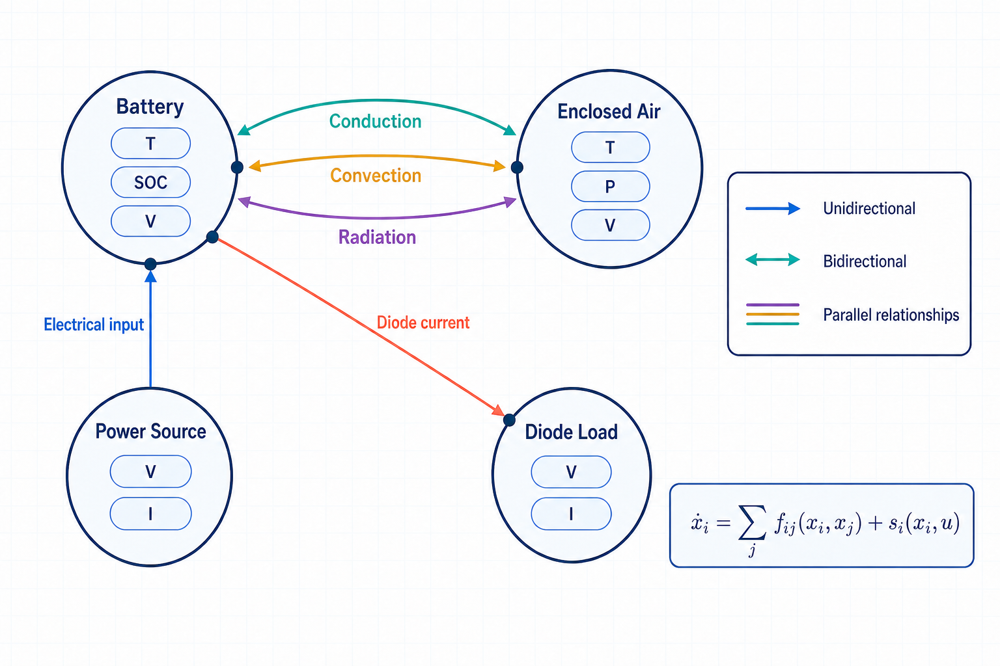

<!-- Copyright © 2026 Zenin Easa Panthakkalakath -->

# Konjugate

This is an attempt to create an open-source graph-native simulation engine for building composable engineering simulations and digital twins.

The objective is to simplify the process of modelling complex physical systems by representing them as networks of interconnected components, where components define states and interactions define the transport of quantities.

Rather than requiring users to manually assemble large system-level formulations, this project explores an approach where systems are represented as graphs of interconnected components. Components define their states and properties, while relationships define the equations governing how quantities are transported and transformed.

<div align="center">
<table>
	<tr>
		<th align="center">Community</th>
		<th align="center">Latest release</th>
	</tr>
	<tr>
		<td align="center"><a href="https://discord.gg/WPUzNyC3S"></a></td>
		<td align="center"><a href="https://github.com/zenineasa/Konjugate/releases/latest"></a></td>
	</tr>
</table>
</div>


## Why build another simulation software?

This is a natural question. As an engineer, I have come across, used and even developed several simulation tools. Modern simulation platforms are extremely powerful and have enabled remarkable advances across many engineering disciplines.

However, many engineering systems are still difficult to model quickly and it is not necessarily due to a lack of capability in existing tools; rather it is because different simulation frameworks are built around different ways of thinking about a system.

Some approaches begin with equations. Others focus on physical domains, block diagrams, meshes or specialised modelling languages. These abstractions are extremely effective within their intended applications, but translating a complex real-world system into the appropriate representation can often require significant effort.

This project explores another perspective: representing systems as networks of interconnected components. Components define their states and properties, while the relationships between them define the mathematical models governing how quantities are transferred and transformed.

The goal is not to replace existing simulation tools, but to explore a flexible and composable framework for modelling complex engineering systems, enabling applications ranging from rapid system prototyping and conjugate multiphysics simulations to the development of digital twins.

## Viewing Systems as Networks of States and Relationships

Engineers often describe dynamic systems using states and their evolution over time.

A general dynamic system can be represented as:

$$
\dot{x}=f(x,u)
$$

where $x$ represents the state vector of the system, $u$ represents external inputs and $f$ describes the mathematical relationships governing the evolution of those states.

However, as systems become larger and more interconnected, the function $f$ often becomes a complex collection of coupled relationships between individual components. Understanding, modifying and extending such models can become increasingly difficult.

This project explores a representation where a system is viewed as a network of states and relationships. Nodes represent stateful components, while relationships represent the interactions that govern how quantities are transferred, transformed or constrained between them.

Instead of defining one large function:

$$
\dot{x}=f(x,u)
$$

the system dynamics can be composed from smaller interaction models:

$$
\dot{x_i} = \sum_j f_{ij}(x_i,x_j) + s_i(x_i,u)
$$

where:

- $x_i$ represents the states contained within a component.
- $f_{ij}$ represents the interaction model between components.
- $s_i$ represents sources, sinks or internal processes affecting the component.


In more practical terms, each node represents a component with values that can change over time. A relationship term $f_{ij}$ describes how one component influences another—for example, convective heat transfer between a battery and its surrounding air. A local term $s_i$ describes what happens within or directly to a component, such as electrical heating, heat loss to the environment or an externally applied input.

Together, these smaller contributions determine how the state of every component evolves.

By composing nodes and relationships, complex systems can be assembled from reusable models.

### A more comprehensive interaction graph

Real systems are often better represented as directed multigraphs than as networks with only one relationship between each pair of nodes. Two components may exchange several quantities through distinct physical mechanisms. For example, conduction, convection and radiation can act simultaneously between a battery and its surroundings, while retaining their own equations, parameters and directionality.

Relationships may be unidirectional, such as an electrical input, diode current or command signal, or reciprocal, such as a thermal or mechanical coupling that contributes to the evolution of both connected components. Reciprocal mechanisms are expressed as complementary state-update contributions and can be grouped together in the interface without losing their individual definitions.



## Current Status

This project is currently in the early stages of development.

## Installing a Release Build

Konjugate isn't code-signed yet — an active choice while the project is in alpha, not an accident — so your OS may show a security warning the first time you open a downloaded release. This doesn't mean the download is corrupted.

- **macOS**: if you see "Konjugate.app is damaged and can't be opened," move it to Applications, then in Terminal run:
  ```bash
  xattr -cr /Applications/Konjugate.app
  ```
  Alternatively, open System Settings → Privacy & Security → Open Anyway.
- **Windows**: if you see a blue "Windows protected your PC" warning from SmartScreen, click **More info**, then click the **Run anyway** button that appears.

## Development

Konjugate supports development on macOS, Windows and Linux.

### Prerequisites

- **Windows**: Node.js 22+, Git, CMake, and Visual Studio 2022+ with **Desktop development with C++**. (Run commands in Developer PowerShell).
- **macOS**: Node.js 22+, CMake (`brew install cmake`), Git, and Xcode Command Line Tools (`xcode-select --install`).
- **Linux (Ubuntu/Debian)**: Node.js 22+, CMake, Git, and C++ build tools (`sudo apt install build-essential cmake git curl zip unzip tar pkg-config`).

### Quick Start

Run the standard procedure on any platform:

```bash
npm ci
npm run setup
npm run dev
```

Setup uses a pinned `vcpkg` baseline for native dependencies (Zlib, OpenSSL, Boost.PropertyTree, METIS) and configures the C++ engine. MSVC builds automatically enable multi-processor parallel compilation (`/MP`); see [the development setup guide](docs/developmentSetup.md) for Windows build performance optimization tips.

## Building

Run the complete host-platform build with:

```bash
make
```

or:

```bash
make build
```

The build installs missing dependencies, generates application and web icons, packages Electron and writes the shareable artifact to `out/release/`.

- macOS produces a DMG.
- Windows produces an installer (`*-setup.exe`) and requires NSIS (`makensis`) on `PATH`. A portable ZIP is also available via `make distributableWindowsPortable`.
- Linux produces an AppImage and requires `appimagetool` on `PATH`. The official download is named after its architecture (e.g. `appimagetool-x86_64.AppImage`), so rename or symlink it to `appimagetool` and mark it executable. See [release packaging](docs/releasePackaging.md) for details.

Generated application bundles are stored in `out/package/`. Run `make clean` to remove dependencies, the lockfile, generated icons, caches and all build outputs.

Every packaged application includes `thirdPartyNotices.md` and the applicable license texts under `thirdPartyLicenses/`. Packaging fails if these compliance files are missing. Native engine builds that include METIS receive the same files in their build directory. See [release packaging](docs/releasePackaging.md) for the host tools and packaged-runtime checks.

## Testing

```bash
npm test                 # unit tests
npm run test:engine      # C++ engine test suite, against the dev build
npm run test:interaction # Electron UI interaction tests, against the dev build
npm run test:all         # unit + interaction
```

Dev-build tests run against `out/engine/` and a plain `electron .` launch. To also catch packaging-only failures they can't reach — a missing bundled library, a resource path that only resolves once laid out the way the packager produces it, code-signing side effects — run the same suites against an actual packaged build instead:

```bash
npm run test:package
```

This packages the app for the host platform (equivalent to `npm run package`) and then runs the engine and interaction suites against that package rather than the dev build. It's slower than the dev-mode suites, since it depends on a fresh package build each time, so treat it as a pre-release check rather than part of the fast dev loop. To run just one half, use `make verifyPackagedEngine` or `make verifyPackagedInteraction` (each also builds the package first).

## Vision and Roadmap

The vision of this project is to create an integrated environment for modelling and simulating complex systems.

The initial focus is on developing a desktop application where users can define components, their states and relationships between them. These models can be explored interactively using a general-purpose simulation engine with real-time visualization.

The desktop application uses a separate native C++ process to validate and execute the same `.kjt` models. The validator and simulation runner are also available through command-line interfaces, keeping model behavior consistent across desktop and automated workflows.

Future directions include an extensible plugin ecosystem where users and developers can contribute physics models, reusable components, visualization tools and other simulation capabilities through the community.

The roadmap includes:

- graph-based system modelling,
- interactive simulation environment,
- high-performance simulation execution,
- extensible physics models,
- AI-assisted modelling workflows.

## Contributing

The project is currently focused on building a strong foundation.

Ideas, discussions and contributions are welcome.

## License

This project is licensed under the Mozilla Public License 2.0. See [LICENSE](LICENSE) for details.

Copyright © 2026 Zenin Easa Panthakkalakath
