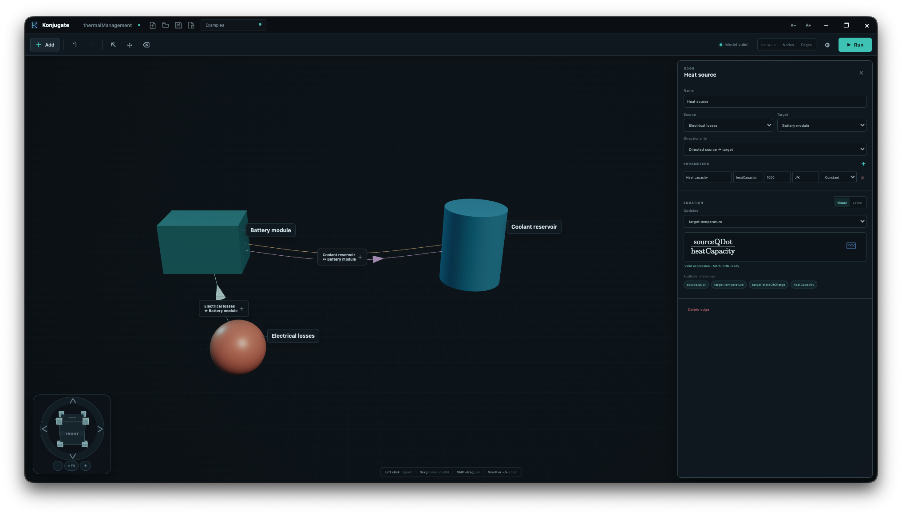
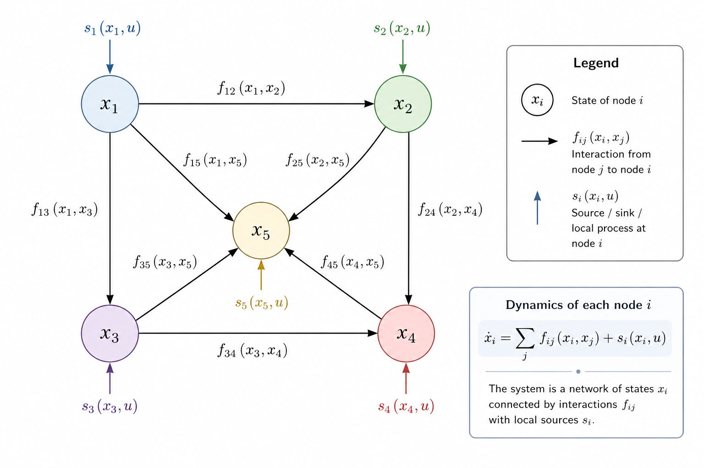

<!-- Copyright © 2026 Zenin Easa Panthakkalakath -->

# Konjugate

This is an attempt to create an open-source graph-native simulation engine for building composable engineering simulations and digital twins.

The objective is to simplify the process of modelling complex physical systems by representing them as networks of interconnected components, where components define states and interactions define the transport of quantities.

Rather than requiring users to manually assemble large system-level formulations, this project explores an approach where systems are represented as graphs of interconnected components. Components define their states and properties, while relationships define the equations governing how quantities are transported and transformed.



---

## Why build another simulation software?

This is a natural question. As an engineer, I have come across, used and even developed several simulation tools. Modern simulation platforms are extremely powerful and have enabled remarkable advances across many engineering disciplines.

However, many engineering systems are still difficult to model quickly and it is not necessarily due to a lack of capability in existing tools; rather it is because different simulation frameworks are built around different ways of thinking about a system.

Some approaches begin with equations. Others focus on physical domains, block diagrams, meshes or specialised modelling languages. These abstractions are extremely effective within their intended applications, but translating a complex real-world system into the appropriate representation can often require significant effort.

This project explores another perspective: representing systems as networks of interconnected components. Components define their states and properties, while the relationships between them define the mathematical models governing how quantities are transferred and transformed.

The goal is not to replace existing simulation tools, but to explore a flexible and composable framework for modelling complex engineering systems, enabling applications ranging from rapid system prototyping and conjugate multiphysics simulations to the development of digital twins.

---

## Viewing Systems as Networks of States and Relationships

Engineers often describe dynamic systems using states and their evolution over time.

A general dynamic system can be represented as:

$$
\dot{x}=f(x,u)
$$

where $x$ represents the state vector of the system, $u$ represents external inputs and $f$ describes the mathematical relationships governing the evolution of those states.

However, as systems become larger and more interconnected, the function $f$ often becomes a complex collection of coupled relationships between individual components. Understanding, modifying and extending such models can become increasingly difficult.

This project explores a representation where a system is viewed as a network of states and relationships. Nodes represent stateful components, while relationships represent the interactions that govern how quantities are transferred, transformed or constrained between them.

Instead of defining one large function:

$$
\dot{x}=f(x,u)
$$

the system dynamics can be composed from smaller interaction models:

$$
\dot{x_i} = \sum_j f_{ij}(x_i,x_j) + s_i(x_i,u)
$$

where:

- $x_i$ represents the states contained within a component.
- $f_{ij}$ represents the interaction model between components.
- $s_i$ represents sources, sinks or internal processes affecting the component.



In more practical terms, each node represents a component with values that can change over time. A relationship term $f_{ij}$ describes how one component influences another—for example, convective heat transfer between a battery and its surrounding air. A local term $s_i$ describes what happens within or directly to a component, such as electrical heating, heat loss to the environment or an externally applied input.

Together, these smaller contributions determine how the state of every component evolves.

By composing nodes and relationships, complex systems can be assembled from reusable models.

---

## Current Status

This project is currently in the early stages of development.

---

## Development

Konjugate currently requires Node.js 22.12 or newer. Start the Electron
application with:

```bash
npm install
npm start
```

The application uses explicit `.mjs` modules for the Electron main, preload,
and renderer processes.

## Building

Run the complete host-platform build with:

```bash
make
```

or:

```bash
make build
```

The build installs missing dependencies, generates application and web icons,
packages Electron and writes the shareable artifact to `out/release/`.

- macOS produces a DMG.
- Windows produces a portable ZIP containing the executable.
- Linux produces an AppImage and requires `appimagetool`.

Generated application bundles are stored in `out/package/`. Run `make clean`
to remove dependencies, the lockfile, generated icons, caches and all build
outputs.

---

## Vision and Roadmap

The vision of this project is to create an integrated environment for modelling and simulating complex systems.

The initial focus is on developing a desktop application where users can define components, their states and relationships between them. These models can be explored interactively using a general-purpose simulation engine with real-time visualization.

The desktop application uses a separate native C++ process to validate and execute the same `.kjt` models. The validator and simulation runner are also available through command-line interfaces, keeping model behavior consistent across desktop and automated workflows.

Future directions include an extensible plugin ecosystem where users and developers can contribute physics models, reusable components, visualization tools and other simulation capabilities through the community.

The roadmap includes:

- graph-based system modelling,
- interactive simulation environment,
- high-performance simulation execution,
- extensible physics models,
- AI-assisted modelling workflows.

---

## Contributing

The project is currently focused on building a strong foundation.

Ideas, discussions and contributions are welcome.

---

## License

This project is licensed under the Mozilla Public License 2.0.
See [LICENSE](LICENSE) for details.

---

Copyright &copy; 2026 Zenin Easa Panthakkalakath
