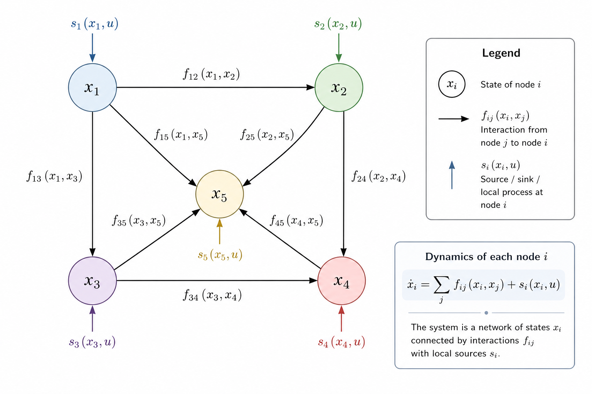

<!-- Copyright © 2026 Zenin Easa Panthakkalakath -->

# Konjugate

This is an attempt to create an open-source graph-native simulation engine for building composable engineering simulations and digital twins.

The objective is to simplify the process of modelling complex physical systems by representing them as networks of interconnected components, where components define states and interactions define the transport of quantities.

Rather than requiring users to manually assemble large system-level formulations, this project explores an approach where systems are represented as graphs of interconnected components. Components define their states and properties, while relationships define the equations governing how quantities are transported and transformed.

<div align="center">
<table>
	<tr>
		<th align="center">Community</th>
		<th align="center">Latest release</th>
	</tr>
	<tr>
		<td align="center"><a href="https://discord.gg/WPUzNyC3S"></a></td>
		<td align="center"><a href="https://github.com/zenineasa/Konjugate/releases/latest"></a></td>
	</tr>
</table>
</div>

<div align="center">
<a href="https://www.youtube.com/watch?v=jiL0kP0VQvQ"></a>
<p>New here? Watch the introduction above, or follow the full <a href="https://www.youtube.com/watch?v=eDHksSqKhFs&list=PLRaxEsOU31bE">On-Ramp series</a> on YouTube, starting from Episode 1.</p>
</div>

## Why build another simulation software?

This is a natural question. As an engineer, I have come across, used and even developed several simulation tools. Modern simulation platforms are extremely powerful and have enabled remarkable advances across many engineering disciplines.

However, many engineering systems are still difficult to model quickly and it is not necessarily due to a lack of capability in existing tools; rather it is because different simulation frameworks are built around different ways of thinking about a system.

Some approaches begin with equations. Others focus on physical domains, block diagrams, meshes or specialised modelling languages. These abstractions are extremely effective within their intended applications, but translating a complex real-world system into the appropriate representation can often require significant effort.

This project explores another perspective: representing systems as networks of interconnected components. Components define their states and properties, while the relationships between them define the mathematical models governing how quantities are transferred and transformed.

The goal is not to replace existing simulation tools, but to explore a flexible and composable framework for modelling complex engineering systems, enabling applications ranging from rapid system prototyping and conjugate multiphysics simulations to the development of digital twins.

## Viewing Systems as Networks of States and Relationships

Engineers often describe dynamic systems using states and their evolution over time.

A general dynamic system can be represented as:

$$
\dot{x}=f(x,u,t)
$$

where $x$ represents the state vector of the system, $u$ represents external inputs, $t$ represents time and $f$ describes the mathematical relationships governing the evolution of those states.

However, as systems become larger and more interconnected, the function $f$ often becomes a complex collection of coupled relationships between individual components. Understanding, modifying and extending such models can become increasingly difficult.

This project explores a representation where a system is viewed as a network of states and relationships. Nodes represent stateful components, while relationships represent the interactions that govern how quantities are transferred, transformed or constrained between them.

Instead of defining one large function:

$$
\dot{x}=f(x,u,t)
$$

the system dynamics can be composed from smaller interaction models:

$$
\dot{x_i} = \sum_j f_{ij}(x_i,x_j,t) + s_i(x_i,u,t)
$$

where:

- $x_i$ represents the states contained within a component.
- $f_{ij}$ represents the interaction model between components.
- $s_i$ represents sources, sinks or internal processes affecting the component.
- $t$ represents simulation time, available to every relationship and local term.



In more practical terms, each node represents a component with values that can change over time. A relationship term $f_{ij}$ describes how one component influences another—for example, convective heat transfer between a battery and its surrounding air. A local term $s_i$ describes what happens within or directly to a component, such as electrical heating, heat loss to the environment or an externally applied input.

Either kind of term can depend on time, and can be piecewise. A heater that only runs during working hours, a supply that drops during a planned outage, or a flow that only exists while a tank is above some level are written directly in the equation. For example,

$$
s_i = \begin{cases} P & 28800 \le t < 64800 \\ 0 & \text{otherwise} \end{cases}
$$

heats with power $P$ between 08:00 and 18:00 of the first day ($t$ is in seconds).

Together, these smaller contributions determine how the state of every component evolves.

By composing nodes and relationships, complex systems can be assembled from reusable models.

## Causal inference

Building a model by hand assumes you already know its structure, which components exist and how they interact. Often you don't; you have a CSV of timeseries data (sensor logs, monitoring exports, historical records) and want to know what's actually driving what before you can start authoring a model.

Konjugate can propose a starting graph from that data directly. Import a CSV of multivariate timeseries, and it finds which columns are related, in which direction, and whether the relationship is linear or curved; then builds real nodes, edges and equations from it, reviewed and accepted before anything is added to your model.

It works in two stages: a lagged partial-correlation pass cheaply screens which variables are worth testing at all, then a joint ridge regression determines each surviving relationship's direction and fits its equation, linear or polynomial. See [Causal inference](docs/causalInference.md) for the full method.

## Add-ons & Plugins

Konjugate ships with a built-in Explorer for discovering and one-click-installing add-ons and plugins, with no central marketplace to run or depend on — see [the Extensions Explorer](docs/extensionsExplorer.md) for how it works. A few real examples are already published:

<table>
<td width="280"><a href="https://github.com/zenineasa/Konjugate-Logistics"></a></td>
<td><strong><a href="https://github.com/zenineasa/Konjugate-Logistics">Konjugate Logistics Toolbox</a></strong><br>Supply-chain and logistics modeling for Konjugate: ports, warehouses, road and rail lanes conserving containers and trucks as stocks and flows, plus a toolbox that turns any region's OpenStreetMap data into a runnable network model.</td>
</tr>
<tr>
<td width="280"><a href="https://github.com/zenineasa/Konjugate-Fintech"></a></td>
<td><strong><a href="https://github.com/zenineasa/Konjugate-Fintech">Konjugate Fintech Toolbox</a></strong><br>Quantitative finance, DeFi, and systemic-risk modeling for Konjugate: interbank contagion stress-testing and market-dynamics causal transmission.</td>
</tr>
<tr>
<td width="280"><a href="https://github.com/zenineasa/Konjugate-PoseVisualizer"></a></td>
<td><strong><a href="https://github.com/zenineasa/Konjugate-PoseVisualizer">Pose Visualizer</a></strong><br>A Three.js 6-DOF pose visualizer for Konjugate results, with timeline-synced playback.</td>
</tr>
<tr>
<td width="280"><a href="https://github.com/zenineasa/Konjugate-ResultPlotViewer"></a></td>
<td><strong><a href="https://github.com/zenineasa/Konjugate-ResultPlotViewer">Results Analysis</a></strong><br>Plotly-backed time-series, scatter and distribution plots for exploring and comparing Konjugate simulation results, with CSV export.</td>
</tr>
<tr>
<td width="280"><a href="https://github.com/zenineasa/Konjugate-HelloWorld"></a></td>
<td><strong><a href="https://github.com/zenineasa/Konjugate-HelloWorld">Hello World</a></strong><br>A minimal Konjugate add-on — the simplest possible example of the add-on API, meant as a starting point for anyone learning to author one.</td>
</tr>
<tr>
</table>

Install any of these from Konjugate's own Extensions dialog (Discover tab), or see [Add-on development](docs/addonDevelopment.md) to build your own.

## Current Status

Konjugate is in active development and public beta, not early-stage anymore — a real cross-platform release pipeline (macOS, Windows, Linux, plus an in-browser preview), causal inference from timeseries data, numerical stability diagnostics, FMU import/export, and an add-on/plugin ecosystem with one-click discovery and installation are already built and in use. The engine, schema and UI are still evolving, and the project isn't code-signed yet (see "Installing a Release Build" below), so treat it as beta-quality rather than a finished 1.0.

## Try It in Your Browser

Want a quick look before installing anything? A free, in-browser trial of Konjugate needs no install: **[try it at zenineasa.github.io/Konjugate](https://zenineasa.github.io/Konjugate/)** <!-- Goes live after GitHub Pages is enabled (Settings > Pages, source: GitHub Actions) and the first version-tag push after that, per .github/workflows/webEdition.yml -->. It's a lightweight preview, not the full app — Run is batch-only there (no live progress or mid-run control), and programmable C++ providers, FMU import/export, add-ons, and AI-assisted authoring aren't available yet. For the full experience, **[download the desktop app](https://github.com/zenineasa/Konjugate/releases/latest)** above.

## Installing a Release Build

Konjugate isn't code-signed yet — an active choice while the project is in beta, not an accident — so your OS may show a security warning the first time you open a downloaded release. This doesn't mean the download is corrupted.

- **macOS**: the recommended way is [Homebrew](https://brew.sh). One command puts Konjugate in your Applications folder, checks the download against its published checksum and opens without a warning:
  ```bash
  brew install --cask zenineasa/konjugate/konjugate
  ```
  Update later with `brew upgrade --cask konjugate`. Because Konjugate isn't signed, Homebrew clears macOS's quarantine flag for you, so macOS hasn't checked the app itself; install it if you trust the project.

  Prefer to download the app yourself? If you see "Konjugate.app is damaged and can't be opened," move it to Applications, then in Terminal run:
  ```bash
  xattr -cr /Applications/Konjugate.app
  ```
  Alternatively, open System Settings → Privacy & Security → Open Anyway.
- **Windows**: install Konjugate from the [Microsoft Store](https://apps.microsoft.com/detail/9p5c9s7dsrpj) — it is signed by Microsoft, so there is no security warning. If you download the installer from the releases page instead and see a blue "Windows protected your PC" warning from SmartScreen, click **More info**, then click the **Run anyway** button that appears.

## Development

Konjugate supports development on macOS, Windows and Linux.

### Prerequisites

- **Windows**: Node.js 24+, Git, CMake, and Visual Studio 2022+ with **Desktop development with C++**. (Run commands in Developer PowerShell).
- **macOS**: Node.js 24+, CMake (`brew install cmake`), Git, and Xcode Command Line Tools (`xcode-select --install`).
- **Linux (Ubuntu/Debian)**: Node.js 24+, CMake, Git, and C++ build tools (`sudo apt install build-essential cmake git curl zip unzip tar pkg-config`).

### Quick Start

Run the standard procedure on any platform:

```bash
npm ci
npm run setup
npm run dev
```

Setup uses a pinned `vcpkg` baseline for native dependencies (Boost.PropertyTree, Eigen3, METIS, NLopt, OpenSSL, Protobuf, Zlib) and configures the C++ engine. MSVC builds automatically enable multi-processor parallel compilation (`/MP`); see [the development setup guide](docs/developmentSetup.md) for Windows build performance optimization tips.

An experimental browser build (see [Konjugate Web](docs/proposals/webEdition.md)) is a separate, opt-in toolchain: `npm run setup:web` (or `make setupWeb`) installs a pinned Emscripten SDK, independently of everything above.

## Building

Run the complete host-platform build with:

```bash
make
```

or:

```bash
make build
```

The build installs missing dependencies, generates application and web icons, packages Electron and writes the shareable artifact to `out/release/`.

- macOS produces a DMG.
- Windows produces an installer (`*-setup.exe`) and requires NSIS (`makensis`) on `PATH`. A portable ZIP is also available via `make distributableWindowsPortable`.
- Linux produces an AppImage and requires `appimagetool` on `PATH`. The official download is named after its architecture (e.g. `appimagetool-x86_64.AppImage`), so rename or symlink it to `appimagetool` and mark it executable. See [release packaging](docs/releasePackaging.md) for details.

Generated application bundles are stored in `out/package/`. Run `make clean` to remove dependencies, the lockfile, generated icons, caches and all build outputs.

Every packaged application includes `ThirdPartyNotices.md` and the applicable license texts under `thirdPartyLicenses/`. Packaging fails if these compliance files are missing. Native engine builds that include METIS receive the same files in their build directory. See [release packaging](docs/releasePackaging.md) for the host tools and packaged-runtime checks.

## Command-line mode

The packaged app can also run a project headlessly from a terminal — no window opens, and it exits when the run finishes. Invoke the app's own executable directly (not through `open`/a shell shortcut) so output streams back and the exit code is real:

```bash
# macOS
/Applications/Konjugate.app/Contents/MacOS/Konjugate --cli run model.kjt --target-time 30 --output-kjt result.kjt --output-csv result.csv

# Windows
Konjugate.exe --cli run model.kjt --target-time 30 --output-kjt result.kjt --output-csv result.csv

# Linux (AppImage — make it executable once with chmod +x)
./Konjugate-*-x86_64.AppImage --cli run model.kjt --target-time 30 --output-kjt result.kjt --output-csv result.csv
```

- `--cli run <project.kjt> --target-time <seconds>` runs the project's active run configuration (or `--configuration <name-or-id>` to pick another) for the given simulated duration.
- `--output-kjt <path>` writes a new `.kjt` with the result embedded, exactly like saving after a run in the GUI.
- `--output-csv <path>` exports the same signal columns the GUI's CSV export button produces — opens directly in Excel or any spreadsheet app.
- `--cli validate <project.kjt>` prints the validation report as JSON and exits `0` if valid, `2` if not.
- An encrypted `.kjt` reads its password from a `KONJUGATE_PASSWORD` environment variable, never a command-line flag, so it never lands in shell history.

This also works against a dev build: `electron . --cli run model.kjt --target-time 30 ...`. A CLI invocation always runs as its own independent process, even while a GUI instance is already open elsewhere.

## Testing

```bash
npm test                 # unit tests
npm run test:engine      # C++ engine test suite, against the dev build
npm run test:interaction # Electron UI interaction tests, against the dev build
npm run test:all         # unit + interaction
```

Dev-build tests run against `out/engine/` and a plain `electron .` launch. To also catch packaging-only failures they can't reach — a missing bundled library, a resource path that only resolves once laid out the way the packager produces it, code-signing side effects — run the same suites against an actual packaged build instead:

```bash
npm run test:package
```

This packages the app for the host platform (equivalent to `npm run package`) and then runs the engine and interaction suites against that package rather than the dev build. It's slower than the dev-mode suites, since it depends on a fresh package build each time, so treat it as a pre-release check rather than part of the fast dev loop. To run just one half, use `make verifyPackagedEngine` or `make verifyPackagedInteraction` (each also builds the package first).

## Vision and Roadmap

The vision of this project is to create an integrated environment for modelling and simulating complex systems.

The initial focus is on developing a desktop application where users can define components, their states and relationships between them. These models can be explored interactively using a general-purpose simulation engine with real-time visualization.

The desktop application uses a separate native C++ process to validate and execute the same `.kjt` models. The validator and simulation runner are also available through command-line interfaces, keeping model behavior consistent across desktop and automated workflows.

An extensible add-on/plugin ecosystem already lets users and developers contribute physics models, reusable components, visualization tools and other simulation capabilities through the community — see [Add-ons & Plugins](#add-ons--plugins) above — and continuing to grow that ecosystem, not building the mechanism itself, is the ongoing direction here.

The roadmap includes:

- graph-based system modelling — built,
- interactive simulation environment — built,
- high-performance simulation execution — built, including partitioned, multi-threaded execution for larger models,
- extensible physics models — built, via the add-on/plugin ecosystem,
- AI-assisted modelling workflows — in progress, via the Model Assistant and causal-inference-driven model proposals.

## Contributing

The project is currently focused on building a strong foundation.

Ideas, discussions and contributions are welcome.

## License

This project is licensed under the Mozilla Public License 2.0. See [LICENSE](LICENSE) for details.

Copyright © 2026 Zenin Easa Panthakkalakath
